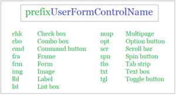

## Reference
### Naming Variables


### UserForm Name Variables Convention



## Base
### FileSystemObject
> Provide your Evidence
#### Create Zip Folder and Copy Files tp from Folder
```vb
Sub CreateZipFile(folderToZipPath As Variant, zippedFileFullName As Variant)

Dim ShellApp As Object

'Create an empty zip file
Open zippedFileFullName For Output As #1
Print #1, Chr$(80) & Chr$(75) & Chr$(5) & Chr$(6) & String(18, 0)
Close #1

'Copy the files & folders into the zip file
Set ShellApp = CreateObject("Shell.Application")
ShellApp.Namespace(zippedFileFullName).CopyHere ShellApp.Namespace(folderToZipPath).items

'Zipping the files may take a while, create loop to pause the macro until zipping has finished.
On Error Resume Next
Do Until ShellApp.Namespace(zippedFileFullName).items.Count = ShellApp.Namespace(folderToZipPath).items.Count
    Application.Wait (Now + TimeValue("0:00:01"))
Loop
On Error GoTo 0

End Sub
```
##### Create Empty Zip Folder
```vb
'Create an empty zip file
Open zippedFileFullName For Output As #1
Print #1, Chr$(80) & Chr$(75) & Chr$(5) & Chr$(6) & String(18, 0)
Close #1
```
##### Copy Files to the Zip Folder Created
```vb
Dim ShellApp As Object
'Copy the files & folders into the zip file
Set ShellApp = CreateObject("Shell.Application")
ShellApp.Namespace(zippedFileFullName).CopyHere ShellApp.Namespace(folderToZipPath).items
```
##### Loop to Wait on zipping each file
```vb
'Zipping the files may take a while, create loop to pause the macro until zipping has finished.
On Error Resume Next
Do Until ShellApp.Namespace(zippedFileFullName).items.Count = ShellApp.Namespace(folderToZipPath).items.Count
    Application.Wait (Now + TimeValue("0:00:01"))
Loop
On Error GoTo 0
```

#### Workbook

